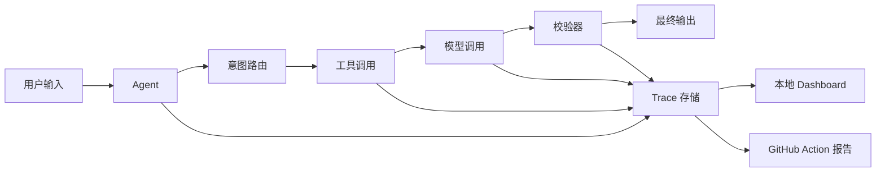

# AgentOps Lite

轻量、本地优先的 AI Agent 观测与质量评测工具。

AgentOps Lite 帮助开发者看清 AI Agent 在一次运行中到底做了什么：使用了哪些 prompt、调用了哪个模型、执行了哪些工具、耗时多少、成本多少、哪里报错、哪些校验通过，以及一次代码或提示词改动是否造成质量退化。

这个项目面向小团队、个人开发者和开源 AI 项目。目标不是做一个沉重的企业级平台，而是让开发者能在几分钟内给自己的 AI Agent 加上可调试、可追踪、可评测的工程能力。

> 当前状态：pre-alpha。这个仓库正在公开构建中。第一阶段目标是完成一个最小可用的 Python SDK、本地 trace 查看器，以及 GitHub Actions AI 质量门禁。

## 为什么需要它

AI Agent 的失败方式和普通软件不一样。

传统 API 通常会用异常、超时或错误状态码告诉你出问题了。但 AI Agent 可能会更“安静”地失败：

- 识别了错误的意图。
- 调用了错误的工具。
- 跳过了必须引用的数据来源。
- 编造了一个数字。
- 花费了过多 token。
- 返回了格式正确但推理错误的 JSON。
- 改了一句 prompt，旧的评测用例悄悄变差。

AgentOps Lite 要做的事情，就是把这些隐藏步骤变成可见的运行轨迹，并把主观的“回答质量”变成可以重复执行的工程检查。

## 它会记录什么

- Agent 运行记录和会话信息
- 意图路由决策
- Prompt 版本和模型调用
- 工具调用、参数、输出、耗时和错误
- Token 用量和预估成本
- 结构化评测结果
- 安全、合规和事实校验结果
- Pull Request 中的质量回归结果

## 目标使用体验

### 记录一次 Agent 运行

```python
from agentops_lite import trace_agent, trace_tool, record_eval

with trace_agent("research-assistant", input="Summarize this earnings call"):
    with trace_tool("web_search", query="company earnings call transcript"):
        results = web_search("company earnings call transcript")

    answer = agent.run(results)

    record_eval(
        name="grounded_answer",
        score=0.91,
        passed=True,
        details={"source_required": "passed", "format": "passed"},
    )
```

### 在 CI 中运行 AI 质量门禁

```yaml
name: AI Quality Gate

on:
  pull_request:

jobs:
  ai-quality-gate:
    runs-on: ubuntu-latest
    steps:
      - uses: actions/checkout@v4
      - uses: chasen2041maker/AgentOps-Lite@v1
        with:
          evals: evals/*.yaml
          min-score: 0.85
```

### 定义评测用例

```yaml
cases:
  - name: grounded_research_answer
    input: "Explain the main risks in this document."
    must_include:
      - "sources"
    forbidden:
      - "guaranteed"
      - "risk-free"
    require_sources: true
    max_tool_calls: 6
    min_score: 0.85
```

## 核心思路

AgentOps Lite 由两个相互连接的部分组成：

1. **观测能力**：看清 Agent 在运行时每一步做了什么。
2. **质量门禁**：在 prompt、工具或代码变更导致 AI 质量下降时，阻止问题进入主分支。



## 计划功能

- 用于记录 Agent 运行的 Python SDK
- 简单的本地 trace 存储
- 展示运行记录、工具调用和评测分数的 Web dashboard
- 基于 YAML 的评测用例
- GitHub Actions 集成
- 在 PR 中评论失败用例和质量摘要
- 导出 JSON，方便接入外部看板
- OpenTelemetry 兼容导出
- LangChain、LangGraph、OpenAI SDK 和自定义 Agent 示例

## 典型使用场景

- 调试 Agent 为什么调用了错误工具
- 在合并 PR 前比较不同 prompt 版本的效果
- 跟踪工具耗时和 token 成本
- 检查回答是否包含必要引用
- 捕获幻觉数字或无来源结论
- 在 CI 中强制执行安全、合规和格式规则
- 为 AI 产品构建轻量级评测套件

## 路线图

### Milestone 1：Trace SDK

- 开始和结束一次 Agent 运行
- 记录模型调用
- 记录工具调用
- 将 trace 保存为本地 JSONL
- 导出运行摘要

### Milestone 2：本地 Dashboard

- 浏览最近运行记录
- 查看分步骤时间线
- 展示耗时、token 用量和错误
- 筛选失败或高风险运行

### Milestone 3：AI 质量门禁

- 加载 YAML 评测用例
- 执行确定性检查
- 生成适合 CI 使用的 JSON 报告
- 当分数低于阈值时让 GitHub Actions 失败
- 在 PR 中添加质量摘要评论

### Milestone 4：框架集成

- LangChain callback adapter
- LangGraph node tracing
- OpenAI-compatible model call wrapper
- FastAPI middleware examples

## 和其他工具有什么不同

AgentOps Lite 不打算一开始就做成完整的企业级观测平台。

它会优先关注：

- 本地优先的开发体验
- 用简单文件替代强制云端存储
- GitHub 原生的质量门禁
- 小型 AI 项目的快速接入
- 能解释 Agent 行为的清晰 trace

## 仓库结构

计划中的结构：

```text
agentops-lite/
  packages/
    python-sdk/
  action/
  dashboard/
  examples/
  evals/
  docs/
```

## 参与贡献

项目还处于非常早期阶段。欢迎以下类型的贡献：

- 真实 AI Agent 失败案例
- 评测用例示例
- SDK API 设计反馈
- Dashboard 交互建议
- GitHub Actions 工作流建议
- 与主流 Agent 框架的集成方案

如果是较大的改动，请先开 issue，描述一个具体的小提案。

## 安全说明

Agent trace 可能包含 prompt、用户输入、API 响应、工具输出和其他敏感数据。AgentOps Lite 的默认设计目标是本地优先存储，并在共享或上传 trace 前显式脱敏。

计划中的安全能力：

- Secret 自动脱敏
- 可配置字段遮罩
- 默认本地模式
- 不做静默远程上传
- CI 报告支持输出截断

## License

本项目计划采用 MIT License。正式发布第一个 tag 前会补充 LICENSE 文件。
