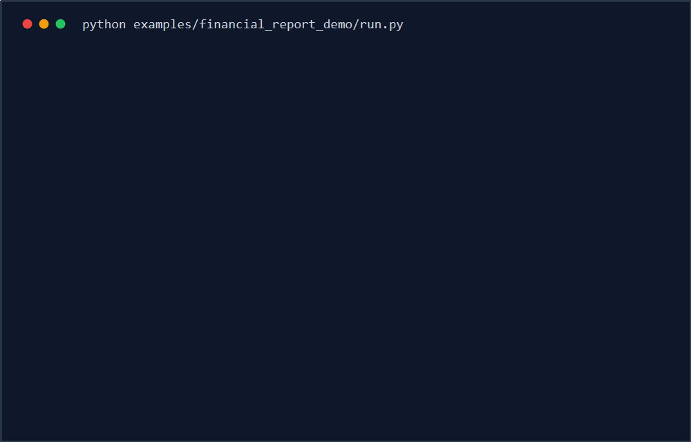
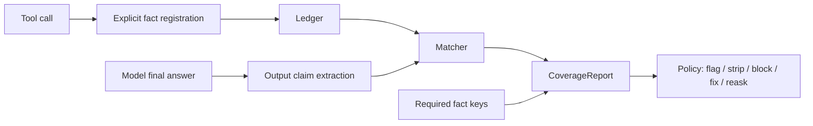

<div align="center">


**Stop tool-using agents from ignoring the facts they already fetched.**

GroundGuard is a deterministic, local-first fact gate for AI agents. It checks
the final answer before release: important numeric claims must trace back to
facts explicitly registered from tool calls, and required facts returned by
tools must not be silently omitted.

[](https://github.com/chasen2041maker/GroundGuard/actions/workflows/ci.yml)


[Docs](docs/index.md) | [Examples](examples) | [Benchmark](benchmarks) |
[Releases](https://github.com/chasen2041maker/GroundGuard/releases) |
[Roadmap](PLAN.md) | [Contributing](CONTRIBUTING.md)

English | [Chinese README](README.zh-CN.md)



</div>

## Why GroundGuard?

Tool-using agents often fail in ways that look normal:

- A tool returns the right data, but the model says the data was unavailable.
- A tool returns no data, but the model invents a confident-looking number.
- A final answer cites numbers that cannot be traced to the current tool run.

The dangerous version is mundane: your agent fetched Q3 revenue, then writes
last year's number into a report for leadership. Nothing crashes. The answer
just looks professional enough to pass human review.

Tracing tools show what happened. LLM-as-judge tools score an answer after it is
written. GroundGuard fills a smaller gap: it gives the final answer a
deterministic, testable fact gate before you let it pass.

GroundGuard started from a problem I kept seeing in my own workflow: tools had
already returned the data, but the model's final answer still contained numbers
that were not reliably checked. Sometimes the model rewrote a number
incorrectly. Sometimes it omitted a key fact that the tool had already returned.
I wanted the path from tool data to final answer to be transparent and
traceable, with a ledger check that can confirm whether the generated numbers
match the facts that were actually retrieved.

In plain terms, GroundGuard works like bookkeeping for agent facts:

1. When a tool returns an important value, you explicitly record it in a local
   ledger.
2. When the model writes the final answer, GroundGuard extracts the numeric
   claims it made.
3. GroundGuard compares the answer against the ledger and reports what was
   verified, missing, invented, or contradicted.
4. Your policy decides whether to only flag the issue, strip unsafe claims, or
   block the answer before it reaches the user.

That means the model can still write naturally, but the key numbers have to
match the facts your tools actually returned.

## Quick Start

```bash
python -m pip install "git+https://github.com/chasen2041maker/GroundGuard.git@v0.2.2"
groundguard-demo
groundguard-benchmark
```

PyPI Trusted Publishing is configured in this repository. Until the PyPI project
is claimed and the first package is published, install from the GitHub tag.

## 10-Second Demo

```bash
python examples/financial_report_demo/run.py
```

The bundled demo reproduces the failure mode GroundGuard is built for:

```text
Before GroundGuard correction
-----------------------------
passed: False
verified: 0
unverified: 0
contradicted: 0
omitted_required: 2
policy_reason: omitted_required_count=2 > max_omitted_required=0

After fact-key correction
-------------------------
passed: True
verified: 2
unverified: 0
contradicted: 0
omitted_required: 0
```

## What Works Today

- In-memory `Ledger` with TTL filtering and JSONL persistence.
- Explicit `tool_call(...).record_facts(...)` registration.
- Deterministic numeric claim extraction with `[fact:key]` markers, Chinese
  amounts, percentages, compact English magnitudes, and common English USD
  formats.
- Extraction transparency: `CoverageReport.suspected_numbers`,
  `uncovered_numbers`, and `extraction_coverage` show which numeric-looking
  spans were seen but not covered by extractors.
- Pluggable extractor registry through `register_extractor(...)` /
  `unregister_extractor(...)`, plus request-scoped extractor lists for
  multi-tenant services that must not mutate global process state.
- Matching statuses: `verified`, `candidate_match`, `unverified`,
  `contradicted`, and `ambiguous`.
- Required fact coverage checks for "tool had data, model omitted it" failures.
- `CoverageReport` and configurable `Policy` evaluation.
- `grounded_generate()` with report return, blocking, conservative stripping,
  optional tagged-claim repair, and one-shot reask.
- `@grounded(...)` decorator for framework-free Python functions.
- `groundguard-report` CLI with native and assertion-style JSON schemas,
  including per-claim `componentResults`.
- Dedicated promptfoo and DeepEval adapter helpers.
- OpenAI-compatible wrapper, LangChain-compatible callback, and LangGraph-style
  node examples.
- A composite GitHub Action for CI fact gates.

## Installation

Install the GitHub tag directly:

```bash
python -m pip install "git+https://github.com/chasen2041maker/GroundGuard.git@v0.2.2"
```

For local development:

```bash
git clone https://github.com/chasen2041maker/GroundGuard.git
cd GroundGuard
python -m pip install -e ".[dev]"
python -m pytest
```

For the live OpenAI SDK example, install the optional SDK extra after cloning:

```bash
python -m pip install -e ".[openai]"
```

## Python API

```python
from decimal import Decimal

from groundguard import Ledger, Policy, grounded_generate, tool_call


def fetch_financials(ticker: str) -> dict[str, str]:
    return {
        "ticker": ticker,
        "net_profit": "823200000",
        "revenue": "3830000000",
    }


def fake_llm(prompt: str) -> str:
    return (
        "Revenue was $3.83 billion [fact:revenue_2025], "
        "and net profit was $823.2 million [fact:net_profit_2025]."
    )


with Ledger(session_id="req_001") as ledger:
    with tool_call("get_company_financials", {"ticker": "ACME"}, ledger) as call:
        result = fetch_financials("ACME")
        call.record_facts(
            {
                "net_profit_2025": (Decimal(result["net_profit"]), "USD"),
                "revenue_2025": (Decimal(result["revenue"]), "USD"),
            },
            raw=result,
        )

    result = grounded_generate(
        prompt="Summarize the latest financial performance.",
        llm_call=fake_llm,
        ledger=ledger,
        required_fact_keys=["net_profit_2025", "revenue_2025"],
        policy=Policy(on_unverified="flag"),
        return_report=True,
    )

print(result.answer)
print(result.report.passed)
```

## Core Concepts

| Concept | What It Means | Why It Matters |
| --- | --- | --- |
| `Fact` | A verifiable value explicitly registered from a tool call. | The only source GroundGuard treats as evidence. |
| `RequiredFact` | A fact key the current answer must cover. | Catches cases where the tool had data but the model ignored it. |
| `OutputClaim` | A numeric claim extracted from the final answer. | Lets GroundGuard verify what the model actually wrote. |
| `CoverageReport` | The final reconciliation report. | Shows verified, candidate, unverified, contradicted, omitted facts, and uncovered numeric-looking spans. |
| `Policy` | Pass/fail thresholds and handling behavior. | Lets you flag, strip, block, repair tagged contradictions, or reask once. |

## How It Works



GroundGuard v1 is deterministic by design: no hosted service, no database, no
second LLM, and no token-level generation control claims.

Current claim extraction is intentionally narrow: it extracts numeric claims
that include a unit or magnitude marker, such as `$3.83 billion`,
`USD 10.25M`, `1.2M`, `3,830 million dollars`, `21.5%`, or
`21.5 percent`. Bare numbers without units are
not treated as verified claims to avoid false positives. They are still exposed
in `CoverageReport.uncovered_numbers`, so users can see what the deterministic
extractors did not cover.

Registered numeric facts are normalized before matching. For example,
`(Decimal("3.83"), "usd_b")`, `(Decimal("3830"), "usd_m")`, and
`(Decimal("3830000000"), "USD")` all compare as the same USD value.

Custom extractors can be registered when your domain needs additional claim
types:

```python
from groundguard import OutputClaim, register_extractor


@register_extractor("ticker_entity")
def extract_tickers(text: str) -> list[OutputClaim]:
    return []
```

For multi-tenant services, prefer request-scoped extractors so one tenant's
rules do not affect another tenant in the same Python process:

```python
from groundguard import extract_output_claims, registered_extractors

claims = extract_output_claims(
    answer,
    extractors=registered_extractors() | {"ticker_entity": extract_tickers},
)

report = ledger.coverage_report(
    answer,
    extractors=registered_extractors() | {"ticker_entity": extract_tickers},
)
```

`register_extractor(...)` is process-global and is best used at application
startup, not dynamically per request.

## Where It Fits

| Tool family | What it is great at | Where GroundGuard fits |
| --- | --- | --- |
| Langfuse / Phoenix | Traces, sessions, observability, debugging timelines. | Adds a deterministic final-answer gate before release. |
| promptfoo / DeepEval | Test suites, eval assertions, scorecards. | Emits assertion-style JSON so fact coverage can be one metric in those suites. |
| LLM-as-judge evaluators | Semantic quality checks and subjective grading. | Avoids a second model for facts that already came from tools. |
| Constrained decoding | Token-level format or grammar control. | Checks post-generation factual coverage; it does not claim token-level control. |

GroundGuard is deliberately narrow: it asks whether the final answer covered and
cited the facts your tools already returned.

## Benchmark

```bash
groundguard-benchmark
```

The bundled deterministic benchmark currently checks 25 cases across verified
answers, omitted required facts, contradicted tagged facts, candidate matches,
ambiguous matches, bare-number extraction limits, and invented unregistered
numbers under a blocking policy. Expected signal:

```text
cases_total: 25
expected_failures: 14
detected_failures: 14
false_positives: 0
```

## CLI

Generate a JSON coverage report from a ledger JSONL file and an answer file:

```bash
groundguard-report \
  --ledger-jsonl facts.jsonl \
  --answer-file answer.txt \
  --required-fact net_profit_2025 \
  --required-fact revenue_2025 \
  --fail-on-policy
```

Without an installed console script:

```bash
python -m groundguard.cli.report --ledger-jsonl facts.jsonl --answer-file answer.txt
```

Use a config file for CI and repeatable eval runs:

```bash
cp groundguard.example.yml groundguard.yml
groundguard-report \
  --config groundguard.yml \
  --ledger-jsonl facts.jsonl \
  --answer-file answer.txt
```

Emit a promptfoo/DeepEval-friendly assertion payload:

```bash
groundguard-report \
  --ledger-jsonl facts.jsonl \
  --answer-file answer.txt \
  --required-fact net_profit_2025 \
  --schema assertion
```

The assertion schema includes `pass`, `success`, `score`, `reason`,
`namedScores`, top-level `claims`, per-claim `componentResults`, and the full
GroundGuard report under `metadata.groundguard`. Each claim exposes
`text_span`, `start`, `end`, `status`, and `diff` for downstream UI
highlighting.

## GitHub Action

Use the composite action in another repository:

```yaml
- name: Run GroundGuard
  uses: chasen2041maker/GroundGuard@v0.2.2
  with:
    ledger-jsonl: groundguard-ledger.jsonl
    answer-file: answer.txt
    config: groundguard.yml
    required-facts: net_profit_2025,revenue_2025
    schema: assertion
    fail-on-policy: "true"
```

For a PR comment example, see
[`docs/examples/github-actions/pr-comment.yml`](docs/examples/github-actions/pr-comment.yml).

## Adapters

OpenAI-compatible chat wrapper:

```python
from groundguard.adapters import openai_chat_llm

llm_call = openai_chat_llm(
    client.chat.completions.create,
    model="gpt-4.1-mini",
)
```

LangChain-compatible callback handler:

```python
from decimal import Decimal

from groundguard.adapters import GroundGuardCallbackHandler

handler = GroundGuardCallbackHandler(
    ledger=ledger,
    fact_mapper=lambda output, context: {
        "net_profit_2025": (Decimal(output["net_profit"]), "CNY"),
    },
)
```

The callback handler intentionally requires an explicit `fact_mapper`; v1 does
not guess which arbitrary JSON fields are evidence.

promptfoo / DeepEval helper functions:

```python
from groundguard.integrations.deepeval import to_deepeval_result
from groundguard.integrations.promptfoo import to_promptfoo_assertion

promptfoo_payload = to_promptfoo_assertion(report)
deepeval_payload = to_deepeval_result(report)
```

## Runnable Examples

Packaged commands:

```bash
groundguard-demo
groundguard-demo --json
groundguard-benchmark
```

Repository examples after cloning:

```bash
python examples/financial_report_demo/run.py
python examples/decorator_demo/run.py
python examples/langgraph_node/run.py
python examples/openai_demo/run.py
python examples/promptfoo_groundguard/run.py
python examples/deepeval_groundguard/run.py
```

`examples/openai_demo/run.py` records tool facts, shows an answer blocked for
omitting those required facts, then shows the corrected fact-key answer passing.

For a live OpenAI SDK call:

```bash
export OPENAI_API_KEY=...
python examples/openai_demo/run.py --live-openai
```

## What GroundGuard Is Not

- Not a tracing dashboard.
- Not an LLM-as-judge evaluator.
- Not a general hallucination detector.
- Not a hosted observability platform.
- Not token-level constrained decoding.
- Not useful for important numbers that are emitted as bare numbers with no
  unit, magnitude, or fact marker.

## Roadmap

- **Milestone 1: Core library** - Ledger, claim extraction, matching, policy,
  `grounded_generate`, and the financial report demo. Implemented.
- **Milestone 2: Framework adapters** - OpenAI wrapper, LangChain callback,
  LangGraph-style node example, and native `@grounded(...)` decorator. Starter
  coverage is implemented; more framework recipes are welcome.
- **Milestone 3: CI integration** - Assertion-style JSON, composite GitHub
  Action, PR comment workflow example, promptfoo/DeepEval helper adapters, and
  per-claim component results. Implemented.
- **Milestone 4: Visualization** - Deferred until the core library and
  distribution path are stable.

## Documentation

- [Docs home](docs/index.md)
- [Getting started](docs/getting-started.md)
- [CLI and config](docs/cli.md)
- [Benchmark](docs/benchmark.md)
- [Architecture](ARCHITECTURE.md)
- [Financial report demo](examples/financial_report_demo/README.md)
- [Brand assets](assets/brand/README.md)
- [Launch kit](docs/launch/README.md)
- [Changelog](CHANGELOG.md)
- [Contributing guide](CONTRIBUTING.md)

## Security

Ledger data may contain prompts, tool outputs, and sensitive business data.
GroundGuard is local-first and does not upload data by default. Always anonymize
fixtures, reports, and examples before sharing them publicly.

## Contributing

Contributions are welcome, especially:

- anonymized "tool had data, model missed it" examples
- claim extraction and matching improvements
- framework integration examples
- API design feedback

Please read [CONTRIBUTING.md](CONTRIBUTING.md) before opening a larger pull
request.

## License

GroundGuard is released under the [MIT License](LICENSE).
