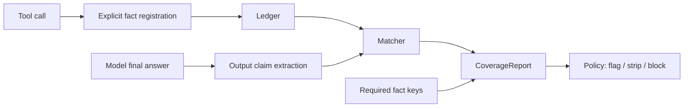

<div align="center">

# GroundGuard

**A local-first fact gate for tool-using AI agents.**

GroundGuard checks an agent's final answer before release: important numeric
claims must trace back to facts explicitly registered from tool calls, and
required facts returned by tools must not be silently omitted.

[](https://github.com/chasen2041maker/GroundGuard/actions/workflows/ci.yml)


English | [简体中文](README.zh-CN.md)

</div>

## Why GroundGuard?

Tool-using agents often fail in ways that look normal:

- A tool returns the right data, but the model says the data was unavailable.
- A tool returns no data, but the model invents a confident-looking number.
- A final answer cites numbers that cannot be traced to the current tool run.

Tracing tools show what happened. LLM-as-judge tools score an answer after it is
written. GroundGuard fills a smaller gap: it gives the final answer a
deterministic, testable fact gate before you let it pass.

## What Works Today

- In-memory `Ledger` with TTL filtering and JSONL persistence.
- Explicit `tool_call(...).record_facts(...)` registration.
- Deterministic numeric claim extraction with `[fact:key]` markers.
- Matching statuses: `verified`, `candidate_match`, `unverified`,
  `contradicted`.
- Required fact coverage checks for "tool had data, model omitted it" failures.
- `CoverageReport` and configurable `Policy` evaluation.
- `grounded_generate()` with report return, blocking, and conservative stripping.
- `groundguard-report` CLI for JSON reports.
- Minimal OpenAI-compatible and LangChain-compatible adapters.
- A reproducible financial report demo.

## Installation

GroundGuard is still pre-alpha and is not published to PyPI yet. Install from
source:

```bash
git clone https://github.com/chasen2041maker/GroundGuard.git
cd GroundGuard
python -m pip install -e ".[dev]"
python -m pytest
```

## Quick Start

```python
from decimal import Decimal

from groundguard import Ledger, Policy, grounded_generate, tool_call


def fetch_financials(ticker: str) -> dict[str, str]:
    return {
        "ticker": ticker,
        "net_profit": "82320000000",
        "revenue": "383000000000",
    }


def fake_llm(prompt: str) -> str:
    return (
        "Revenue was 3830 亿元 [fact:revenue_2025], "
        "and net profit was 823.2 亿元 [fact:net_profit_2025]."
    )


with Ledger(session_id="req_001") as ledger:
    with tool_call("get_company_financials", {"ticker": "ACME"}, ledger) as call:
        result = fetch_financials("ACME")
        call.record_facts(
            {
                "net_profit_2025": (Decimal(result["net_profit"]), "CNY"),
                "revenue_2025": (Decimal(result["revenue"]), "CNY"),
            },
            raw=result,
        )

    result = grounded_generate(
        prompt="Summarize the latest financial performance.",
        llm_call=fake_llm,
        ledger=ledger,
        required_fact_keys=["net_profit_2025", "revenue_2025"],
        policy=Policy(on_unverified="flag"),
        return_report=True,
    )

print(result.answer)
print(result.report.passed)
```

Run the bundled demo:

```bash
python examples/financial_report_demo/run.py
```

The demo shows the core failure mode clearly:

```text
Before GroundGuard correction
-----------------------------
passed: False
verified: 0
unverified: 0
contradicted: 0
omitted_required: 2
policy_reason: omitted_required_count=2 > max_omitted_required=0

After fact-key correction
-------------------------
passed: True
verified: 2
unverified: 0
contradicted: 0
omitted_required: 0
```

## Core Concepts

| Concept | What It Means | Why It Matters |
| --- | --- | --- |
| `Fact` | A verifiable value explicitly registered from a tool call. | The only source GroundGuard treats as evidence. |
| `RequiredFact` | A fact key the current answer must cover. | Catches cases where the tool had data but the model ignored it. |
| `OutputClaim` | A numeric claim extracted from the final answer. | Lets GroundGuard verify what the model actually wrote. |
| `CoverageReport` | The final reconciliation report. | Shows verified, candidate, unverified, contradicted, and omitted facts. |
| `Policy` | Pass/fail thresholds and handling behavior. | Lets you flag, strip, or block unsafe output. |

## How It Works



GroundGuard v1 is deterministic by design: no hosted service, no database, no
second LLM, and no token-level generation control claims.

Current claim extraction is intentionally narrow: v0.1.0 only extracts numeric
claims that include a unit or magnitude marker, such as `823.2 亿元`, `21.5%`,
or `10.25 亿美元`. Bare numbers without units are ignored to avoid false
positives.

## CLI

Generate a JSON coverage report from a ledger JSONL file and an answer file:

```bash
groundguard-report \
  --ledger-jsonl facts.jsonl \
  --answer-file answer.txt \
  --required-fact net_profit_2025 \
  --required-fact revenue_2025 \
  --fail-on-policy
```

Without an installed console script:

```bash
python -m groundguard.cli.report --ledger-jsonl facts.jsonl --answer-file answer.txt
```

## Adapters

OpenAI-compatible chat wrapper:

```python
from groundguard.adapters import openai_chat_llm

llm_call = openai_chat_llm(
    client.chat.completions.create,
    model="gpt-4.1-mini",
)
```

LangChain-compatible callback handler:

```python
from decimal import Decimal

from groundguard.adapters import GroundGuardCallbackHandler

handler = GroundGuardCallbackHandler(
    ledger=ledger,
    fact_mapper=lambda output, context: {
        "net_profit_2025": (Decimal(output["net_profit"]), "CNY"),
    },
)
```

The callback handler intentionally requires an explicit `fact_mapper`; v1 does
not guess which arbitrary JSON fields are evidence.

## What GroundGuard Is Not

- Not a tracing dashboard.
- Not an LLM-as-judge evaluator.
- Not a general hallucination detector.
- Not a hosted observability platform.
- Not token-level constrained decoding.

## Roadmap

- **Milestone 1: Core library** - Ledger, claim extraction, matching, policy,
  `grounded_generate`, and demo. Mostly implemented.
- **Milestone 2: Framework adapters** - More LangChain/LangGraph examples,
  native decorator helpers, and common agent framework recipes.
- **Milestone 3: CI integration** - promptfoo/DeepEval-compatible assertions and
  PR comments showing coverage regressions.
- **Milestone 4: Visualization** - Local report diff and lightweight timelines.

## Documentation

- [Architecture](ARCHITECTURE.md)
- [Financial report demo](examples/financial_report_demo/README.md)
- [Changelog](CHANGELOG.md)
- [Contributing guide](CONTRIBUTING.md)

## Security

Ledger data may contain prompts, tool outputs, and sensitive business data.
GroundGuard is local-first and does not upload data by default. Always anonymize
fixtures, reports, and examples before sharing them publicly.

## Contributing

Contributions are welcome, especially:

- anonymized "tool had data, model missed it" examples
- claim extraction and matching improvements
- framework integration examples
- API design feedback

Please read [CONTRIBUTING.md](CONTRIBUTING.md) before opening a larger pull
request.

## License

GroundGuard is released under the [MIT License](LICENSE).
