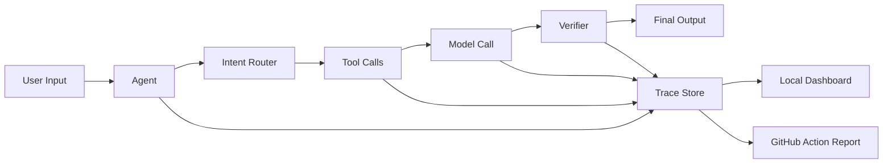

# AgentOps Lite

Lightweight, local-first observability and evals for AI agents.

AgentOps Lite helps developers see what their AI agents actually did: prompts,
model calls, tool calls, latency, cost, errors, verification results, and quality
regressions. It is designed for small teams, solo builders, and open-source AI
projects that need practical agent debugging without adopting a heavy platform.

> Status: pre-alpha. This repository is being shaped in public. The first goal is
> a minimal Python SDK, local trace viewer, and GitHub Actions quality gate.

## Why

AI agents fail differently from normal software.

A traditional API usually fails with an exception, timeout, or bad status code.
An agent can fail more quietly:

- It chooses the wrong intent.
- It calls the wrong tool.
- It skips a required source.
- It invents a number.
- It spends too many tokens.
- It returns valid JSON with bad reasoning.
- A prompt change silently makes old cases worse.

AgentOps Lite turns those hidden steps into visible traces and repeatable checks.

## What It Records

- Agent runs and sessions
- Intent routing decisions
- Prompt versions and model calls
- Tool calls, arguments, outputs, latency, and errors
- Token usage and estimated cost
- Structured eval results
- Guardrail and verifier outcomes
- Regression results from pull requests

## Target Developer Experience

### Trace an Agent Run

```python
from agentops_lite import trace_agent, trace_tool, record_eval

with trace_agent("research-assistant", input="Summarize this earnings call"):
    with trace_tool("web_search", query="company earnings call transcript"):
        results = web_search("company earnings call transcript")

    answer = agent.run(results)

    record_eval(
        name="grounded_answer",
        score=0.91,
        passed=True,
        details={"source_required": "passed", "format": "passed"},
    )
```

### Run Evals in CI

```yaml
name: AI Quality Gate

on:
  pull_request:

jobs:
  ai-quality-gate:
    runs-on: ubuntu-latest
    steps:
      - uses: actions/checkout@v4
      - uses: chasen2041maker/AgentOps-Lite@v1
        with:
          evals: evals/*.yaml
          min-score: 0.85
```

### Define Eval Cases

```yaml
cases:
  - name: grounded_research_answer
    input: "Explain the main risks in this document."
    must_include:
      - "sources"
    forbidden:
      - "guaranteed"
      - "risk-free"
    require_sources: true
    max_tool_calls: 6
    min_score: 0.85
```

## Core Ideas

AgentOps Lite has two connected parts:

1. Observability: inspect how an agent behaved at runtime.
2. Quality gate: prevent prompt, tool, or code changes from reducing AI quality.



## Planned Features

- Python SDK for tracing agent runs
- Simple local trace store
- Web dashboard for runs, tool calls, and eval scores
- YAML-based eval cases
- GitHub Actions integration
- PR comments with failed cases and quality summaries
- JSON export for external dashboards
- OpenTelemetry-compatible export
- Examples for LangChain, LangGraph, OpenAI SDK, and custom agents

## Example Use Cases

- Debug why an agent called the wrong tool
- Compare prompt versions before merging a pull request
- Track tool latency and token cost
- Check that answers include required citations
- Catch hallucinated numbers or unsupported claims
- Enforce safety, compliance, and formatting rules in CI
- Build a lightweight evaluation suite for an AI product

## Roadmap

### Milestone 1: Trace SDK

- Start and finish agent runs
- Record model calls
- Record tool calls
- Save traces as local JSONL
- Export trace summaries

### Milestone 2: Local Dashboard

- Browse recent runs
- Inspect step-by-step timelines
- View latency, token usage, and errors
- Filter failed or risky runs

### Milestone 3: AI Quality Gate

- Load YAML eval cases
- Run deterministic checks
- Produce CI-friendly JSON reports
- Fail GitHub Actions when score is below threshold
- Add PR summary comments

### Milestone 4: Framework Integrations

- LangChain callback adapter
- LangGraph node tracing
- OpenAI-compatible model call wrapper
- FastAPI middleware examples

## How This Is Different

AgentOps Lite is not trying to be a full enterprise observability platform.

It focuses on:

- Local-first development
- Simple files over required cloud storage
- GitHub-native quality gates
- Fast onboarding for small AI projects
- Clear traces that explain agent behavior

## Repository Structure

Planned structure:

```text
agentops-lite/
  packages/
    python-sdk/
  action/
  dashboard/
  examples/
  evals/
  docs/
```

## Contributing

The project is early. Useful contributions include:

- Real-world AI agent failure cases
- Eval case examples
- SDK API feedback
- Dashboard UX ideas
- GitHub Actions workflow suggestions
- Integrations with popular agent frameworks

Open an issue with a small, concrete proposal before large changes.

## Security

Agent traces may contain prompts, user input, API responses, tool outputs, and
other sensitive data. The default design goal is local-first storage and explicit
redaction before sharing or uploading traces.

Planned safeguards:

- Secret redaction
- Configurable field masking
- Local-only default mode
- No silent remote upload
- CI-safe reports with optional output truncation

## License

This project is intended to use the MIT License. A LICENSE file will be added
before the first tagged release.
