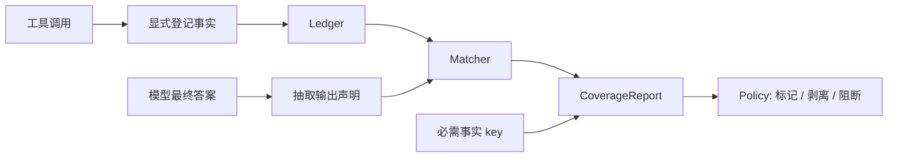

<div align="center">

# GroundGuard

**给工具调用型 AI Agent 加一层本地优先的事实门禁。**

GroundGuard 会在 Agent 最终输出放行前做确定性核对：关键数字必须能追溯到工具调用中显式登记的事实；工具已经返回、且本轮必须覆盖的事实，也不能被模型静默遗漏。

[](https://github.com/chasen2041maker/GroundGuard/actions/workflows/ci.yml)


[English](README.md) | 简体中文

</div>

## 为什么需要 GroundGuard？

工具调用型 Agent 最容易出问题的地方，往往不是报错，而是“看起来很正常”：

- 工具明明返回了正确数据，模型却说本轮没有拿到数据。
- 工具没有查到结果，模型却编出一个语气自信的数字。
- 最终答案写了关键数字，但无法追溯到本轮工具调用。

Tracing 工具能告诉你发生了什么；LLM-as-judge 工具能在生成后打分。GroundGuard 补的是更窄但更硬的一层：在最终答案放行前，用确定性、可测试的方式核对“模型写出来的事实”是否真的来自工具结果。

## 当前能力

- 内存版 `Ledger`，支持 TTL 过滤和 JSONL 落盘/加载。
- 通过 `tool_call(...).record_facts(...)` 显式登记工具事实。
- 规则版数字声明抽取，支持 `[fact:key]` 显式引用。
- 匹配状态：`verified`、`candidate_match`、`unverified`、`contradicted`。
- 必需事实覆盖检查，能抓住“工具有数据，模型却没用上”的失败。
- `CoverageReport` 与可配置 `Policy`。
- `grounded_generate()` 支持返回报告、阻断输出、保守剥离未核实声明。
- `groundguard-report` CLI 输出 JSON 报告。
- 最小 OpenAI-compatible 和 LangChain-compatible 适配器。
- 可复现的财务报告 demo。

## 安装

GroundGuard 仍处于 pre-alpha 阶段，暂未发布到 PyPI。当前请从源码安装：

```bash
git clone https://github.com/chasen2041maker/GroundGuard.git
cd GroundGuard
python -m pip install -e ".[dev]"
python -m pytest
```

## 快速开始

```python
from decimal import Decimal

from groundguard import Ledger, Policy, grounded_generate, tool_call


def fetch_financials(ticker: str) -> dict[str, str]:
    return {
        "ticker": ticker,
        "net_profit": "82320000000",
        "revenue": "383000000000",
    }


def fake_llm(prompt: str) -> str:
    return (
        "收入为 3830 亿元 [fact:revenue_2025]，"
        "净利润为 823.2 亿元 [fact:net_profit_2025]。"
    )


with Ledger(session_id="req_001") as ledger:
    with tool_call("get_company_financials", {"ticker": "ACME"}, ledger) as call:
        result = fetch_financials("ACME")
        call.record_facts(
            {
                "net_profit_2025": (Decimal(result["net_profit"]), "CNY"),
                "revenue_2025": (Decimal(result["revenue"]), "CNY"),
            },
            raw=result,
        )

    result = grounded_generate(
        prompt="总结这家公司最新的财务表现。",
        llm_call=fake_llm,
        ledger=ledger,
        required_fact_keys=["net_profit_2025", "revenue_2025"],
        policy=Policy(on_unverified="flag"),
        return_report=True,
    )

print(result.answer)
print(result.report.passed)
```

运行内置 demo：

```bash
python examples/financial_report_demo/run.py
```

## 核心概念

| 概念 | 含义 | 作用 |
| --- | --- | --- |
| `Fact` | 从工具调用中显式登记的一条可核实事实。 | GroundGuard 只把它当作事实依据。 |
| `RequiredFact` | 本轮回答必须覆盖的事实 key。 | 抓住“工具已经返回，但模型遗漏”的情况。 |
| `OutputClaim` | 从最终答案里抽取出的数字声明。 | 核对模型实际写了什么。 |
| `CoverageReport` | 最终对账报告。 | 展示已核实、候选匹配、未核实、矛盾和遗漏。 |
| `Policy` | 通过/失败阈值和处理行为。 | 决定标记、剥离还是阻断不安全输出。 |

## 工作流



GroundGuard v1 保持确定性：不依赖托管服务、不引入数据库、不用第二个 LLM 做判断，也不承诺 token 级生成控制。

## CLI

从 Ledger JSONL 和 answer 文本生成 JSON Coverage Report：

```bash
groundguard-report \
  --ledger-jsonl facts.jsonl \
  --answer-file answer.txt \
  --required-fact net_profit_2025 \
  --required-fact revenue_2025 \
  --fail-on-policy
```

如果还没有安装命令行入口，也可以直接运行：

```bash
python -m groundguard.cli.report --ledger-jsonl facts.jsonl --answer-file answer.txt
```

## 适配器

OpenAI-compatible chat wrapper：

```python
from groundguard.adapters import openai_chat_llm

llm_call = openai_chat_llm(
    client.chat.completions.create,
    model="gpt-4.1-mini",
)
```

LangChain-compatible callback handler：

```python
from decimal import Decimal

from groundguard.adapters import GroundGuardCallbackHandler

handler = GroundGuardCallbackHandler(
    ledger=ledger,
    fact_mapper=lambda output, context: {
        "net_profit_2025": (Decimal(output["net_profit"]), "CNY"),
    },
)
```

这个 callback handler 故意要求你提供显式 `fact_mapper`；v1 不会自动猜任意 JSON 里的哪些字段应该被当成事实。

## GroundGuard 不是什么

- 不是 tracing dashboard。
- 不是 LLM-as-judge 评测器。
- 不是通用幻觉检测器。
- 不是托管式可观测性平台。
- 不是 token 级受控解码。

## 路线图

- **Milestone 1：核心库** - Ledger、声明抽取、匹配、Policy、`grounded_generate` 和 demo，已基本完成。
- **Milestone 2：框架适配** - 更多 LangChain/LangGraph 示例、原生装饰器和常见 Agent 框架接入配方。
- **Milestone 3：CI 集成** - promptfoo/DeepEval 兼容断言格式，以及 PR 中展示 Coverage 回归。
- **Milestone 4：可视化** - 本地报告 diff 和轻量时间线。

## 文档

- [架构设计](ARCHITECTURE.md)
- [财务报告 demo](examples/financial_report_demo/README.md)
- [发布说明草稿](docs/release-notes-draft.md)
- [贡献指南](CONTRIBUTING.md)

## 安全说明

Ledger 中可能包含 prompt、工具输出和敏感业务数据。GroundGuard 默认本地优先，不会静默上传数据。公开分享 fixture、报告或示例前，请先做脱敏。

## 参与贡献

欢迎以下类型的贡献：

- 脱敏后的“工具有数据，但模型没用上”失败案例。
- 声明抽取和匹配算法改进。
- 框架集成示例。
- API 设计反馈。

较大的改动请先阅读 [CONTRIBUTING.md](CONTRIBUTING.md)，并开 issue 说明动机和建议 API。

## License

GroundGuard 基于 [MIT License](LICENSE) 发布。
