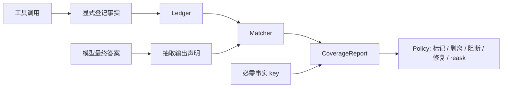

<div align="center">


**给工具调用型 AI Agent 加一层本地优先的事实门禁。**

GroundGuard 会在 Agent 最终输出放行前做确定性核对：关键数字必须能追溯到工具调用中显式登记的事实；工具已经返回、且本轮必须覆盖的事实，也不能被模型静默遗漏。

[](https://github.com/chasen2041maker/GroundGuard/actions/workflows/ci.yml)
[](https://pypi.org/project/groundguard-ai/)


[PyPI](https://pypi.org/project/groundguard-ai/) | [English](README.md) | 简体中文


</div>

## 为什么需要 GroundGuard？

工具调用型 Agent 最容易出问题的地方，往往不是报错，而是“看起来很正常”：

- 工具明明返回了正确数据，模型却说本轮没有拿到数据。
- 工具没有查到结果，模型却编出一个语气自信的数字。
- 最终答案写了关键数字，但无法追溯到本轮工具调用。

最危险的版本往往很日常：Agent 明明查到了 Q3 营收，最后却把去年的数字写进给管理层看的报告里。程序没有报错，答案也很像样，但事实已经偏了。

Tracing 工具能告诉你发生了什么；LLM-as-judge 工具能在生成后打分。GroundGuard 补的是更窄但更硬的一层：在最终答案放行前，用确定性、可测试的方式核对“模型写出来的事实”是否真的来自工具结果。

GroundGuard 的起点很简单：我在自己的真实工作流里发现，大模型生成的很多数字并没有经过可靠的事实校验。工具已经返回了数据，但模型最终写出的数字可能和工具结果不一致，也可能遗漏掉本该使用的关键事实。

所以我想让“工具数据 -> 模型回答”这条链路变得透明、可追溯。GroundGuard 会把工具返回的关键事实登记到账本里，再用确定性的账本比对确认最终输出中的数字是否可信。这也是它名字里的 Guard：不是替模型思考，而是在答案放行前守住事实边界。

大白话讲，GroundGuard 做的就是“记账 + 对账”：

1. 工具查到了关键数字，就先把这个数字明确登记到账本里。
2. 模型写最终答案时，GroundGuard 把答案里的关键数字声明抽出来。
3. GroundGuard 拿模型写出来的数字和账本里的事实对一遍，告诉你哪些已核实、哪些没依据、哪些和工具结果矛盾、哪些工具已经返回但模型漏掉了。
4. 最后再按策略决定：只是标记问题、剥离不安全声明，还是直接拦住这次答案。

这样模型仍然可以正常生成自然语言，但关键数字不能“随口一写”：它必须能追溯到这次工具实际返回的事实。

## 10 秒看懂

```bash
groundguard-demo
```

内置 demo 复现的就是 GroundGuard 要拦的核心失败：

```text
Before GroundGuard correction
-----------------------------
passed: False
verified: 0
unverified: 0
contradicted: 0
omitted_required: 2
policy_reason: omitted_required_count=2 > max_omitted_required=0

After fact-key correction
-------------------------
passed: True
verified: 2
unverified: 0
contradicted: 0
omitted_required: 0
```

## 当前能力

- 内存版 `Ledger`，支持 TTL 过滤和 JSONL 落盘/加载。
- 通过 `tool_call(...).record_facts(...)` 显式登记工具事实。
- 规则版数字声明抽取，支持 `[fact:key]` 显式引用、中文金额、百分比、英文量级缩写和常见英文 USD 金额。
- 抽取透明化：`CoverageReport.suspected_numbers`、`uncovered_numbers` 和 `extraction_coverage` 会告诉你哪些疑似数字被看见了，但没有被确定性 extractor 覆盖。
- 可插拔 extractor 注册表：通过 `register_extractor(...)` / `unregister_extractor(...)` 增加领域专属声明抽取逻辑；多租户服务也可以给单次 `coverage_report(...)` 传入 request-scoped extractors，避免改动进程级全局状态。
- 匹配状态：`verified`、`candidate_match`、`unverified`、`contradicted`、`ambiguous`。
- 必需事实覆盖检查，能抓住“工具有数据，模型却没用上”的失败。
- `CoverageReport` 与可配置 `Policy`。
- `grounded_generate()` 支持返回报告、阻断输出、保守剥离未核实声明、可选修复带 fact key 的矛盾数字，以及一次性 reask。
- `@grounded(...)` 装饰器，适合零框架纯 Python 函数。
- `groundguard-report` CLI 支持原生 GroundGuard JSON 和 assertion 风格 JSON，并输出 per-claim `componentResults`。
- promptfoo / DeepEval 专用 helper adapter。
- OpenAI-compatible wrapper、LangChain-compatible callback、LangGraph-style node 示例。
- 可复用 GitHub Action，用于 CI 事实门禁。

## 安装

GroundGuard 仍处于 pre-alpha 阶段，已发布到 PyPI。PyPI 分发包名是 `groundguard-ai`，Python 导入名仍然是 `groundguard`。PyPI 最新发布版本：`0.2.3`；main 分支已准备下一个 `0.2.4` 版本。

```bash
python -m pip install groundguard-ai
```

本地开发请从源码安装：

```bash
git clone https://github.com/chasen2041maker/GroundGuard.git
cd GroundGuard
python -m pip install -e ".[dev]"
python -m pytest
```

如果要运行真实 OpenAI SDK 示例，clone 后再安装可选依赖：

```bash
python -m pip install -e ".[openai]"
```

## 快速开始

```python
from decimal import Decimal

from groundguard import Ledger, Policy, grounded_generate, tool_call


def fetch_financials(ticker: str) -> dict[str, str]:
    return {
        "ticker": ticker,
        "net_profit": "82320000000",
        "revenue": "383000000000",
    }


def fake_llm(prompt: str) -> str:
    return (
        "收入为 3830 亿元 [fact:revenue_2025]，"
        "净利润为 823.2 亿元 [fact:net_profit_2025]。"
    )


with Ledger(session_id="req_001") as ledger:
    with tool_call("get_company_financials", {"ticker": "ACME"}, ledger) as call:
        result = fetch_financials("ACME")
        call.record_facts(
            {
                "net_profit_2025": (Decimal(result["net_profit"]), "CNY"),
                "revenue_2025": (Decimal(result["revenue"]), "CNY"),
            },
            raw=result,
        )

    result = grounded_generate(
        prompt="总结这家公司最新的财务表现。",
        llm_call=fake_llm,
        ledger=ledger,
        required_fact_keys=["net_profit_2025", "revenue_2025"],
        policy=Policy(on_unverified="flag"),
        return_report=True,
    )

print(result.answer)
print(result.report.passed)
```

## 核心概念

| 概念 | 含义 | 作用 |
| --- | --- | --- |
| `Fact` | 从工具调用中显式登记的一条可核实事实。 | GroundGuard 只把它当作事实依据。 |
| `RequiredFact` | 本轮回答必须覆盖的事实 key。 | 抓住“工具已经返回，但模型遗漏”的情况。 |
| `OutputClaim` | 从最终答案里抽取出的数字声明。 | 核对模型实际写了什么。 |
| `CoverageReport` | 最终对账报告。 | 展示已核实、候选匹配、未核实、矛盾、遗漏，以及未被抽取覆盖的疑似数字。 |
| `Policy` | 通过/失败阈值和处理行为。 | 决定标记、剥离、阻断、修复带标签的矛盾数字，或 reask 一次。 |

## 工作流



GroundGuard v1 保持确定性：不依赖托管服务、不引入数据库、不用第二个 LLM 做判断，也不承诺 token 级生成控制。

当前声明抽取范围是刻意收窄的：只抽取带单位或量级词的数值声明，例如 `823.2 亿元`、`21.5%`、`10.25 亿美元`、`$3.83 billion`、`USD 10.25M`、`1.2M`、`3,830 million dollars`、`21.5 percent`。没有单位的裸数字不会被当作已核实声明，以减少误报；但它们会暴露在 `CoverageReport.uncovered_numbers` 里，让你知道确定性 extractor 没覆盖哪些数字。

登记进账本的数值事实会先归一化再匹配。例如 `(Decimal("823.2"), "亿元")`、`(Decimal("8232000"), "万元")`、`(Decimal("82320000000"), "CNY")` 会被当作同一个 CNY 基础值比较。

## 它放在工具链哪里

| 工具类型 | 擅长什么 | GroundGuard 补什么 |
| --- | --- | --- |
| Langfuse / Phoenix | traces、sessions、调试时间线、可观测性。 | 在最终答案放行前加一层确定性事实门禁。 |
| promptfoo / DeepEval | 测试集、断言、评分报表。 | 输出 assertion 风格 JSON，让事实覆盖率成为其中一个指标。 |
| LLM-as-judge 评测 | 语义质量、主观评分。 | 对“工具已经返回的事实”不用第二个模型判断。 |
| constrained decoding | token 级格式或语法约束。 | 做生成后的事实覆盖核对，不承诺 token 级控制。 |

GroundGuard 有意保持窄：它只回答“最终答案是否覆盖并引用了工具已经返回的事实”。

## CLI

从 Ledger JSONL 和 answer 文本生成 JSON Coverage Report：

```bash
groundguard-report \
  --ledger-jsonl facts.jsonl \
  --answer-file answer.txt \
  --required-fact net_profit_2025 \
  --required-fact revenue_2025 \
  --fail-on-policy
```

如果还没有安装命令行入口，也可以直接运行：

```bash
python -m groundguard.cli.report --ledger-jsonl facts.jsonl --answer-file answer.txt
```

输出 promptfoo/DeepEval 友好的 assertion payload：

```bash
groundguard-report \
  --ledger-jsonl facts.jsonl \
  --answer-file answer.txt \
  --required-fact net_profit_2025 \
  --schema assertion
```

assertion schema 包含 `pass`、`success`、`score`、`reason`、`namedScores`，并提供带 `text_span`、`start`、`end`、`status`、`diff` 的顶层 `claims` 列表，方便下游 UI 精确高亮每条声明；完整 GroundGuard 报告放在 `metadata.groundguard`。
现在还会输出 per-claim `componentResults`，promptfoo / DeepEval 可以直接把每条 claim 当成可解释的子结果使用。

## GitHub Action

在其他仓库里可以这样接入：

```yaml
- name: Run GroundGuard
  uses: chasen2041maker/GroundGuard@v0.2.2
  with:
    ledger-jsonl: groundguard-ledger.jsonl
    answer-file: answer.txt
    config: groundguard.yml
    required-facts: net_profit_2025,revenue_2025
    schema: assertion
    fail-on-policy: "true"
```

PR 自动评论示例见 [`docs/examples/github-actions/pr-comment.yml`](docs/examples/github-actions/pr-comment.yml)。

## 适配器

OpenAI-compatible chat wrapper：

```python
from groundguard.adapters import openai_chat_llm

llm_call = openai_chat_llm(
    client.chat.completions.create,
    model="gpt-4.1-mini",
)
```

LangChain-compatible callback handler：

```python
from decimal import Decimal

from groundguard.adapters import GroundGuardCallbackHandler

handler = GroundGuardCallbackHandler(
    ledger=ledger,
    fact_mapper=lambda output, context: {
        "net_profit_2025": (Decimal(output["net_profit"]), "CNY"),
    },
)
```

这个 callback handler 故意要求你提供显式 `fact_mapper`；v1 不会自动猜任意 JSON 里的哪些字段应该被当成事实。

## 可运行示例

安装后可直接运行：

```bash
groundguard-demo
groundguard-demo --json
groundguard-benchmark
```

`groundguard-benchmark` 会运行两组确定性 benchmark：25 条核心 smoke case，以及 200 条中英文真实样例数据集。后者覆盖英文/中文输出、USD/EUR/GBP/CNY、百分比、基点、用户、订单、工单、延迟、存储单位、候选匹配、漏写事实、矛盾事实、歧义匹配和裸数字抽取边界。当前期望信号：

```text
smoke.cases_total: 25
smoke.expected_failures: 14
smoke.detected_failures: 14
smoke.false_positives: 0
realistic_dataset.cases_total: 200
realistic_dataset.expected_failures: 71
realistic_dataset.detected_failures: 71
realistic_dataset.false_positives: 0
realistic_dataset.false_negatives: 0
```

clone 仓库后还可以运行：

```bash
python examples/financial_report_demo/run.py
python examples/decorator_demo/run.py
python examples/langgraph_node/run.py
python examples/openai_demo/run.py
python examples/promptfoo_groundguard/run.py
python examples/deepeval_groundguard/run.py
```

真实 OpenAI SDK 调用：

```bash
export OPENAI_API_KEY=...
python examples/openai_demo/run.py --live-openai
```

## GroundGuard 不是什么

- 不是 tracing dashboard。
- 不是 LLM-as-judge 评测器。
- 不是通用幻觉检测器。
- 不是托管式可观测性平台。
- 不是 token 级受控解码。
- 不适合核对没有单位、量级或 fact marker 的裸数字。

## 路线图

- **Milestone 1：核心库** - Ledger、声明抽取、匹配、Policy、`grounded_generate` 和财务 demo，已实现。
- **Milestone 2：框架适配** - OpenAI wrapper、LangChain callback、LangGraph-style node 示例和原生 `@grounded(...)` 装饰器已有 starter 覆盖；欢迎继续补框架配方。
- **Milestone 3：CI 集成** - assertion 风格 JSON、composite GitHub Action、PR 评论 workflow 示例、promptfoo/DeepEval helper adapter 和 per-claim component results 已实现。
- **Milestone 4：可视化** - 暂缓，等核心库和分发路径稳定后再做。

## 文档

- [文档首页](docs/index.md)
- [快速上手](docs/getting-started.md)
- [CLI 与配置](docs/cli.md)
- [Benchmark](docs/benchmark.md)
- [架构设计](ARCHITECTURE.md)
- [财务报告 demo](examples/financial_report_demo/README.md)
- [品牌资产](assets/brand/README.md)
- [冷启动发布素材](docs/launch/README.md)
- [更新日志](CHANGELOG.md)
- [贡献指南](CONTRIBUTING.md)

## 安全说明

Ledger 中可能包含 prompt、工具输出和敏感业务数据。GroundGuard 默认本地优先，不会静默上传数据。公开分享 fixture、报告或示例前，请先做脱敏。

## 参与贡献

欢迎以下类型的贡献：

- 脱敏后的“工具有数据，但模型没用上”失败案例。
- 声明抽取和匹配算法改进。
- 框架集成示例。
- API 设计反馈。

较大的改动请先阅读 [CONTRIBUTING.md](CONTRIBUTING.md)，并开 issue 说明动机和建议 API。

## License

GroundGuard 基于 [MIT License](LICENSE) 发布。
